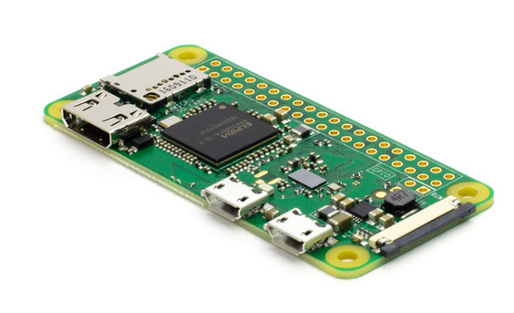

# MRPMG-Docklands

A repo of sample projects for Rpi and ESP32

## Introduction

In the coming sessions we will encourage our members to extend there knowledge by sharing and experiencing new aspects of all things microcontroller and computer.

We will start with some 'simple' projects to get used to working on a new platform/environment

Please feel free to clone this and fork it for your own purposes

## Platforms

RPi Zero one

[RPi Zero Version 1.3 from Mouser](https://au.mouser.com/ProductDetail/Raspberry-Pi/SC0019?qs=rQFj71Wb1eUTUmywZo0nqA%3D%3D&mgh=1&vip=1&srsltid=AfmBOopNBpkS3Wu4sUSBqWcSk4nPya8Yd-0MRyvC9qcC8A8VxcX6byH2DrY)

ESP32-WROVER

[ESP32-WROVER from Lonely Binary](https://lonelybinary.com/collections/esp32/products/lonely-binary-esp32-wrover-the-king-of-esp32)
